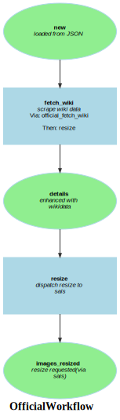

Markdown for OfficialWorkflow




## fetch_wiki -- guard


```php
#[AsGuardListener(self::WORKFLOW_NAME, self::TRANSITION_FETCH_WIKI)]
public function onGuard(GuardEvent $event): void
{
    if (!$this->getOfficial($event)->getWikidataId()) {
        $event->setBlocked(true, "missing wiki id.");
    }
}
```
blob/main/src/Workflow/OfficialWorkflow.php#L55-60
        


## fetch_wiki -- transition


```php
#[AsTransitionListener(self::WORKFLOW_NAME, self::TRANSITION_FETCH_WIKI)]
public function onFetchWiki(TransitionEvent $event): void
{
    $official = $this->getOfficial($event);
    $filesystem = $this->defaultStorage;
    $this->wikiService->setCacheTimeout(60 * 60 * 24);
    $wikiData = $this->wikiService->fetchWikidataPage($official->getWikidataId());
    $official->setWikiData($wikiData->toArray());
}
```
blob/main/src/Workflow/OfficialWorkflow.php#L63-70
        

## resize -- transition


```php
    #[AsTransitionListener(self::WORKFLOW_NAME, self::TRANSITION_RESIZE)]
    public function onResize(TransitionEvent $event): void
    {
        $official = $this->getOfficial($event);
        $wikiData = $official->getWikiData();

//        $p18 = $wikiData['properties']['P18'];
        /** @var Collection $values */

        $values = $wikiData['properties']['P18']['values']??[];
//        dump($p18, $values->getIterator());
        /** @var Value $item */
        $images = [];
        foreach ($values as $item) {
            // we could do this in an async message, too.
            if ($url = $item['id']) {
                $official->setOriginalImageUrl($url);
                $response = $this->saisClientService->dispatchProcess(new ProcessPayload(AppLoadDataCommand::SAIS_CLIENT, [
                    $url
                ],
                thumbCallbackUrl: $x=$this->urlGenerator->generate('app_webhook', ['id' => $official->getId()], $this->urlGenerator::ABS_URL)
                ));
                break; // first one only, for now.
            }
        }
    }
```
blob/main/src/Workflow/OfficialWorkflow.php#L93-117
        


## fetch_wiki -- completed


```php
#[AsCompletedListener(self::WORKFLOW_NAME, self::TRANSITION_FETCH_WIKI)]
public function onFetchWikiCompleted(CompletedEvent $event): void
{
    $this->entityManager->flush();
    $this->entityManager->clear();
    // this is because Properties is an Illuminate collection and needs to be an array
    $official = $this->entityManager->find(Official::class, $this->getOfficial($event)->getId());
    foreach ([self::TRANSITION_RESIZE] as $nextTransition) {
        if ($this->officialWorkflow->can($official, $nextTransition)) {
            $env = $this->messageBus->dispatch(new TransitionMessage(
                $official->getId(),
                $official::class,
                $nextTransition,
                self::WORKFLOW_NAME,
            ));
        }
    }
}
```
blob/main/src/Workflow/OfficialWorkflow.php#L73-89
        
